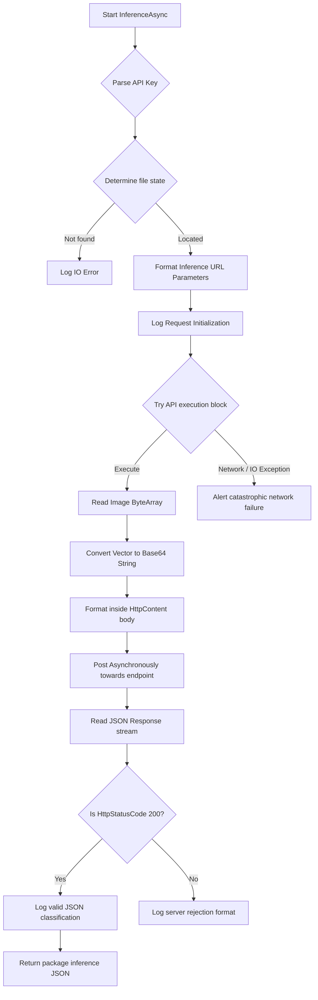

# AI Package Detection Module

To guarantee detection capabilities when parcels breach the physical security scanning zone, the backend delegates complex image rendering to an externalized Vision Transformer (ViT) classification inference pipeline. Bypassing limited localized nodes preserves significant computational assets for hardware regulation routines.

## System Architecture: Classification vs Object Detection

Establishing a highly optimal, lightweight inference framework required scrutinizing visual modeling strategies. Initial algorithmic drafts explored bounding-box Object Detection architectures (such as YOLOv8). While these models physically locate volumetric anomalies throughout a picture vector, they force intense graphical latency due to coordinate-map calculations, which heavily degrades performance on IoT edges.

Because the SmartPackageBox relies fundamentally on absolute state conditions (empty box versus occupied box), switching to a **Binary Classification Model** was mathematically superior. 

- **Dimensional Reduction**: Classification reduces the output layer to a strict boolean vector ("Package" or "No Package"), bypassing spatial tensor computations.
- **Iteration Acceleration**: Providing exactly one confidence metric accelerated operational iteration speeds significantly in conjunction with the Raspberry Pi processing bandwidth limitations.
- **Vision Transformer (ViT)**: The deployment utilizes a ViT architecture, leveraging self-attention mechanisms to weigh global inter-pixel relationships, yielding highly stable detection parameters across varying lighting conditions internal to the container.

## Dataset Construction & Batch Annotation

Maintaining model stability necessitates broad diversity among the testing data. The deployed binary classifier traces its root generation across roughly 10,000 unique image vectors.

### 1. Sourcing and Labeling Parameters
Initial collections leveraged physical, internal representations collected dynamically inside the mock structural hardware, rigorously combined with vast open-source repository subsets. Keyframe acquisitions prioritized:
- Fluctuating exterior ambient reflections.
- Irregular cardboard formats and label obstructions.
- Shifting geometric shapes standard among courier plastic polybags.

### 2. Automated Annotator Script (`Batch-Annotate.sh`)
Labeling 10,000 raw frames manually introduces severe fatigue and human error constants. To optimize the data validation pipeline on local Linux workstations (Wayland), a dedicated Bash script (`Batch-Annotate.sh`) was engineered.

This script executes a low-level automation loop acting directly on the system input server via the `ydotool` daemon. 

```bash
# Core logic extracted from Batch-Annotate.sh
$YDTOOL_CMD type "@" # Designates Class '1' or 'Package'
sleep "$WAIT_TIME_SHORT"
$YDTOOL_CMD key "$KC_ENTER:1" "$KC_ENTER:0"
sleep "$WAIT_TIME_SHORT"
$YDTOOL_CMD key "$KC_LCTRL:1"
$YDTOOL_CMD key "$KC_RIGHT:1" "$KC_RIGHT:0" # Navigate Next Item
$YDTOOL_CMD key "$KC_LCTRL:0"
```
Instead of requiring manual graphic interface interactions inside the annotation interface (Roboflow), the custom shell executable loops keystroke injections (`1` -> `Enter` -> `Ctrl+Right`). This exponentially accelerates classification tagging during large-scale dataset normalization.

### 3. Repository Deployment
The entirety of the mapping configurations, structural data layers, and live inference model endpoints securely rest within the Roboflow network infrastructure: [Package Detection Classification Dataset](https://universe.roboflow.com/eindwerk/packagedetection-xyah9).

## Offline Inference Communication Topology

Due to obvious structural boundaries facing the primary logic runner (`Raspberry Pi Zero 2W`), the ViT model itself executes autonomously over an `HP EliteDesk 800 G1 SFF` acting as the network homelab inference server (Debian GNU/Linux 12). 

Maintaining operational integrity locally whilst ensuring programmatic stability mandates the following communications flowchart:

1. **Payload Extraction**: Image fragments acquired via the Logitech internal array are isolated organically out of local physical memory mapping matrices resulting in uncompressed byte subsets.
2. **Structural Encoding**: Integrating the data across HTTP protocol streams necessitates mutating the raw binary structure directly into an encapsulated Base64 string payload.
3. **Application Protocol (POST)**: The resulting encoded data gets compiled natively into `application/x-www-form-urlencoded` limits, minimizing data-fragment loss whilst traversing generic HTTP POST endpoints.



### Tunnel Security Parameters
To ensure testing viability regardless of physical constraints across varying mobile internet environments, the offline inference server utilizes Cloudflare Tunnels to reverse-proxy network boundaries. Access into the active tensor algorithms is strictly governed via hardcoded API-Key authentications required linearly upon instantiation commands minimizing malicious intrusion surfaces effectively.