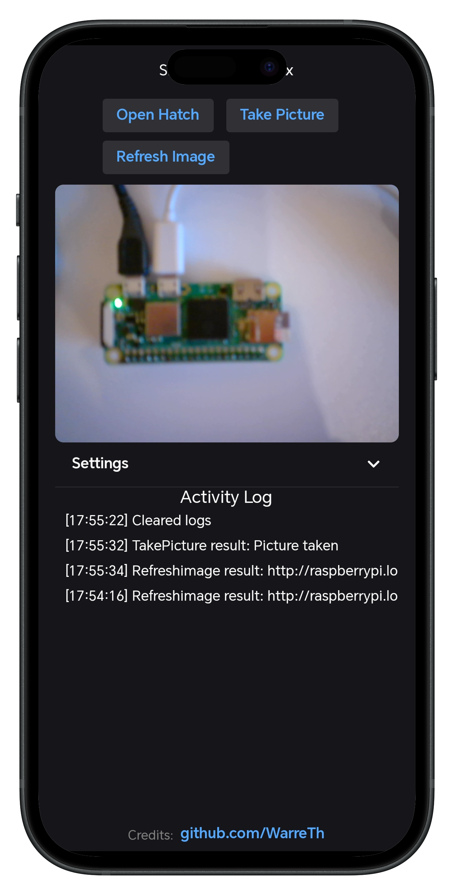
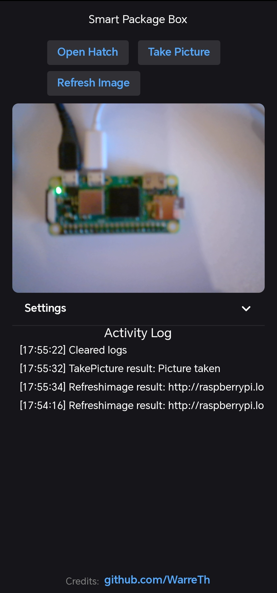
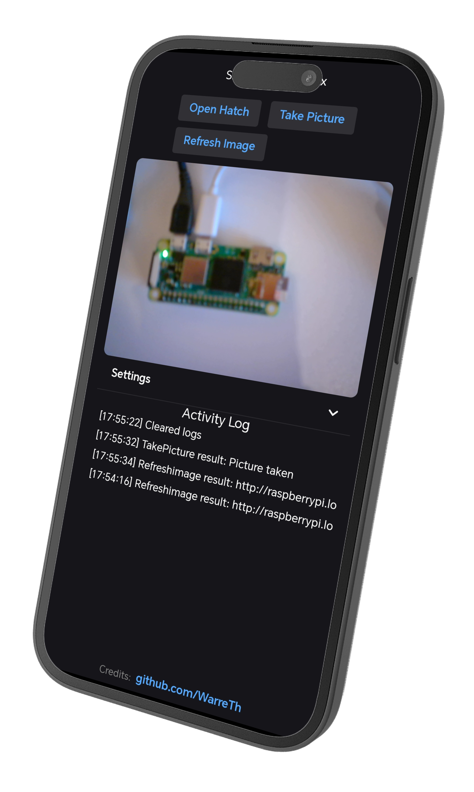

# Companion Application (Avalonia UI)

To guarantee that the owner maintains ultimate control over the SmartPackageBox without relying exclusively on the internal AI automation pipeline, an extensive companion application was engineered. Because the physical deployment incorporates independent micro-services (such as the Image Server and the API command endpoints), the application serves as a centralized telemetry dashboard.

The application allows users to override mechanical hatch states, toggle detection algorithms, actively view the camera feed, and monitor HTTP transmission logs all from a single graphical interface.

## 1. UI/UX Design & Cross-Platform Compilation

The client was developed using **[Avalonia UI](https://avaloniaui.net/)**, a highly robust XAML-based UI framework for .NET. The decision to use Avalonia rather than Windows Presentation Foundation (WPF) or .NET MAUI ensures that the singular codebase can compile into native, highly performant binaries for:
- **Desktop**: Windows, macOS, and Linux
- **Mobile**: Android (Native APK)
- **Web/iOS**: WebAssembly (allowing iPhone and Safari access without Apple Developer Program restrictions)

### Responsive Grid Layout

Instead of creating separate project views for different operating systems, the `MainView.axaml` utilizes structural components like `ScrollViewer`, `Expander`, and `WrapPanel`. These allow UI elements to reflow dynamically based on screen real estate, ensuring scalability across wildly different viewports.

<div style="display: flex; gap: 10px; justify-content: center; align-items: flex-start; margin-top: 20px; margin-bottom: 20px;">
  
  
  
</div>

*(Above: The Android compilation maps the Action buttons cleanly into a vertical list, ensuring touch targets remain large and accessible).*

On the Desktop, the interface spans outward, creating a broader control layout.


## 2. Software Architecture (MVVM Pattern)

To successfully isolate the background networking threads from the primary UI rendering threads, the project heavily utilizes the **Model-View-ViewModel (MVVM)** software architectural pattern via the `CommunityToolkit.Mvvm` library.

### Viewmodel Injection (`MainViewModel.cs`)

The `[ObservableProperty]` source generator allows variables to seamlessly bind directly to the XAML frontend without writing repetitive boilerplate setter logic.

```csharp
public partial class MainViewModel : ViewModelBase
{
    [ObservableProperty]
    private string imageServerUrl = "http://raspberrypi.local:8081/latest.png";

    [ObservableProperty]
    private string apiUrl = "https://raspberrypi.local:8080";
    
    [ObservableProperty]
    private bool imageVisible = true;

    public ObservableCollection<string> LogMessages { get; } = new ObservableCollection<string>();
    
    private readonly ApiService _apiService = new ApiService();
    // ...
}
```

This enforces strict separation: the UI only cares about rendering the states dictated by `LogMessages` or `imageVisible`, whilst the Viewmodel exclusively manages the background state mechanics.

## 3. Hardware Communication & API Service

Rather than running complex TCP socket listeners, the application operates purely as an HTTP client. It transmits commands to the Raspberry Pi Zero 2W's C# API asynchronously.

### Relay Commands & Async Polling

When a user taps an action inside the application (e.g., "Toggle Detection" or "Take Picture"), Avalonia binds this UI event directly to a `[RelayCommand]` method:

```csharp
[RelayCommand]
private async Task MoveHatchAsync()
{
    string? result = await _apiService.ContactUrlAsync(ApiUrl, "move-hatch");

    bool isOpen;
    if (result == "true" || result == "false")
    {
        isOpen = Convert.ToBoolean(result);
    }
    else
    {
        Log($"Openhatch request failed: unexpected response '{result}'");
        OnPropertyChanged(nameof(LogMessages));
        return;
    }
    result = isOpen ? "Hatch is now open" : "Hatch is now closed";
    Log($"Openhatch result: {result}");
}
```

The underlying `ApiService.cs` then handles the network transmission. Notably, it implements a custom `HttpClientHandler` to bypass strict SSL validation rules on local networks, ensuring uninterrupted telemetry execution. 


*(The integrated Activity Log continuously updates the user regarding HTTP Handshakes, exposing network errors transparently).*


## 4. Live Camera Feed Handling

One of the most complex tasks within the mobile framework is retrieving heavy JPG/PNG packets without freezing the main application interaction loops. The `MainView.axaml` actively uses the `AsyncImageLoader.Avalonia` package.

```xml
<Border Grid.Row="1" CornerRadius="8" ClipToBounds="True" IsVisible="{Binding ImageVisible}">
    <Image asyncImageLoader:ImageLoader.Source="{Binding NewestImageUrl}" Stretch="Uniform"/>
</Border>
```

When the user triggers the "Refresh Image" button, the client pings the `/newest-url` API endpoint, parses the localized image frame, and renders the latest camera extraction asynchronously. 

## 5. Persistent Background Notification (ntfy.sh)

Relying purely on the Avalonia Client to remain continuously active in the foreground would result in severe smartphone battery degradation. Instead, the backend system implements **ntfy.sh** for decentralized push-notifications.

Whenever the Vision Transformer (ViT) locally confirms a physical package deposit, it fires an isolated JSON packet containing the exact time and a base64 encoded snapshot to the ntfy server structure. 


This immediately triggers a wake-up call to the owner's iPhone or Android device, presenting the high-priority alert on the system lock screen independently. Users can then subsequently open the Avalonia companion application for further manual inspection.
