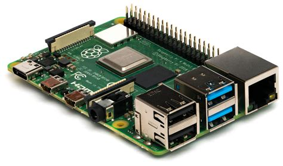
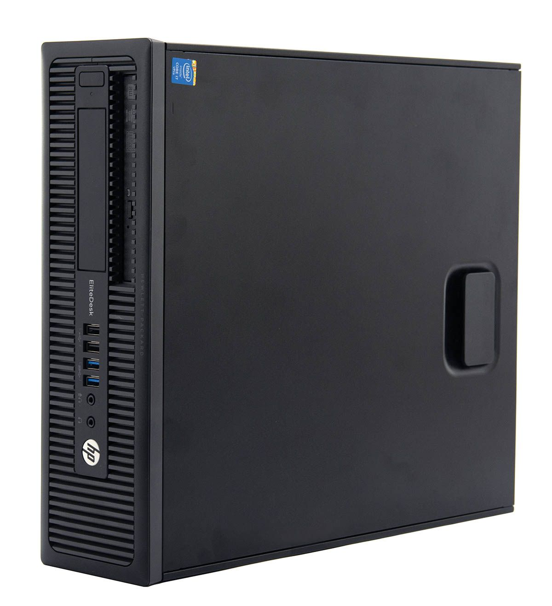
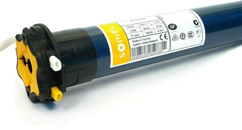
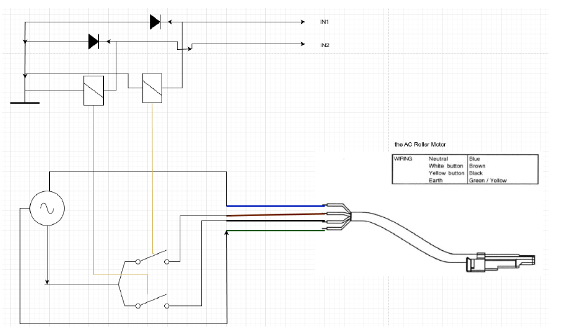
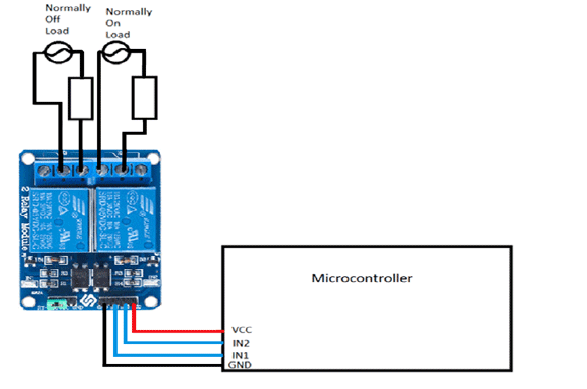
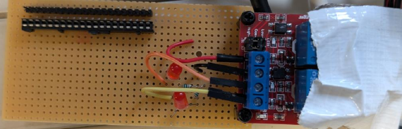
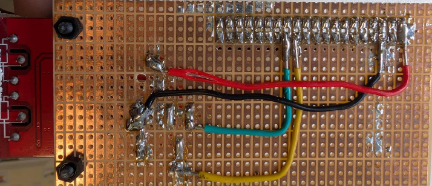
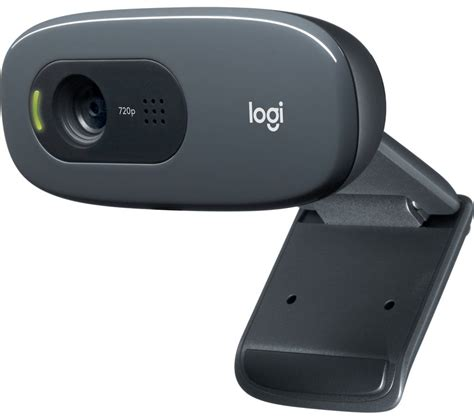
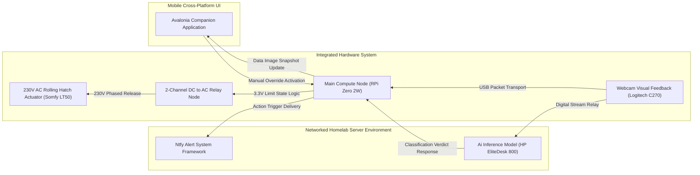

# Hardware Components and Infrastructure

The execution of the SmartPackageBox relies on bridging low-voltage logic-level software with high-voltage physical mechanics. The structural backbone combines commercial engineering with tailored electronic schematics, delegating processing computing to specific network nodes and safely managing actuator limits.

## Computational and Logic Controllers

### 1. Main Compute Node: Raspberry Pi Zero 2W
Serving as the internal orchestrator, the Raspberry Pi Zero 2W operates natively on a 5V DC plane. It was specifically selected for its highly compact footprint, native Wi-Fi networking, and ARMv7 architecture which permits execution of the compiled C# `.NET 9` framework. 

* **Consumption**: Operates at approximately 1.2W nominal.
* **Connectivity**: Commands external relay states via digital GPIO multiplexing while synchronously retrieving video fragments via USB connections.

### 2. The AI Inference Homelab: HP EliteDesk 800 G1 SFF
Due to local computing hardware limitations, evaluating AI models (like Vision Transformers) on a Raspberry Pi is unfeasible. The heavy computational lifting was offloaded via network protocols to an isolated, locally hosted inference server.

* **Hardware**: Intel Core i5-4570 @ 3.6GHz, 16GB Memory.
* **Software**: Debian GNU/Linux 12 (Bookworm) runtime.
* **Function**: Computes image frames dynamically, effectively converting standard HTTP requests into Boolean logic responses without cloud delays.

## Opto-Isolated Mechanization

Automating physical package security necessitates actuating heavy mechanisms safely. This requires entirely severing the Pi’s logic array from the commercial mains voltage required to power standard commercial tube motors.

### 1. The Actuator: Somfy LT50 Roll Motor
The physical roll-hatch covering the package container is driven by an industrial Somfy LT50 motor operating on an AC 230V mains grid.

* **Mechanical Limits (Endelopes)**: A crucial aspect of selecting this specific commercial engine is the inclusion of internal mechanical limit switches. Because the tubular motor naturally disengages when fully unwound or retracted, the software does not inherently have to control exact millisecond rotations—preventing motor burn-outs caused by CPU stutters entirely.
* **Power Draw**: Commands roughly 253W during engagement but rests in an inactive standby state.

### 2. High-Voltage Integration: 2-Channel Relay Module
Because the RPi Zero 2W operates on 3.3V GPIO digital signals, it cannot switch 230V alternating currents directly. A 5V-operated 2-channel relay acts as an opto-isolator. 
* Channel 1 engages the *Open* phase utilizing a Normal Closed (NC) loop.
* Channel 2 engages the *Close* phase utilizing a Normal Open (NO) loop.

*To ensure system resilience during software debugging phases, a manual override circuit was also mapped, allowing physical switches to trigger the Somfy block independently of the GPIO headers.*

## Visual Validation Subsystem

### Logitech C270 Webcam Integration
Sourced directly for its USB 2.0 native compatibility and 720p visual reliability, the Logitech C270 captures the internal cavity limits. 

* To integrate with the RPi Zero 2W's limited ports, a standard USB-A to Micro-USB adapter maintains the data pipeline, transmitting raw frame arrays straight into the internal `.NET` image buffers for analysis.

## Physical Network Topology

The full integration structure revolves around the internal Pi node acting as a broker. It polls input statuses and triggers actuation upon positive AI validations.

