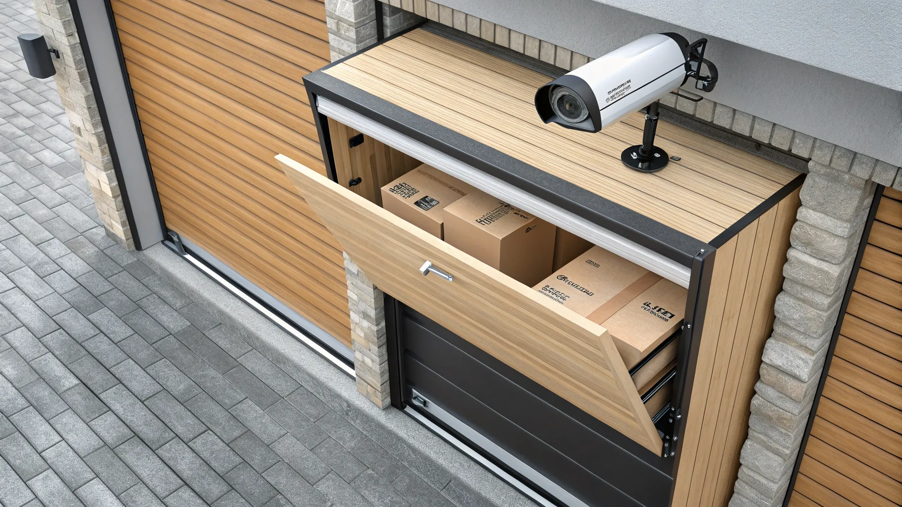
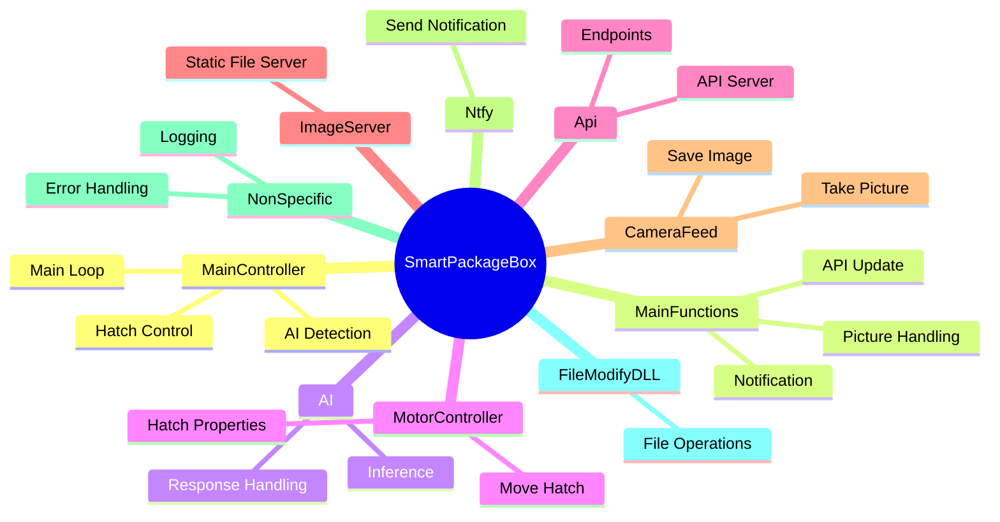

# SmartPackageBox Documentation

Welcome to the comprehensive technical documentation for the SmartPackageBox. This repository contains the source code, hardware schematics, and AI pipeline structure for a fully automated, standalone package security framework.

Driven by the increasing prevalence of package theft across residential areas, this thesis project bridges multiple technological disciplines; incorporating IoT hardware integration, custom backend software architecture, and neural network image classification into a single unified deployment.

## Project Scope and Objective

Traditional mechanical delivery boxes rely entirely on courier compliance or complex physical locks. This project re-evaluates the approach by building an active verification model:
1. **Detect**: Continuously survey the internal container space.
2. **Classify**: Utilize a local Vision Transformer model to verify if a package has genuinely been deposited.
3. **Actuate**: Mechanically seal the container leveraging a high-voltage industrial motor.
4. **Notify**: Dispatch real-time telemetry and snapshot data to the owner.

## Core Documentation Segments

### [Hardware Elements and Networks](HARDWARE.md)
Detailed infrastructure breakdowns covering physical computing limitations. Topics involve the Raspberry Pi Zero 2W core, safe 230V isolation strategies via 2-channel relay modules, and the 720p optics arrays.

### [Software Architecture & Executables](SOFTWARE.md)
Contains extensive overviews of the native C# applications (.NET 9). Investigates internal classes, the Avalonia companion app, buffer flushing on USB devices, and Cache-Busting HTTP transmission topologies.

### [Companion Application](APP.md)
Detailed overview of the Avalonia UI cross-platform client for Desktop and Android. Showcases the dashboards, live camera feed configurations, API polling methods, and integrated Ntfy push notifications.

### [Artificial Intelligence Subsystem](AI_MODEL.md)
Elaborates on the internal Vision Transformer (ViT) logic, dataset harvesting, Base64 payload transmissions, and how secure isolated inference runs locally via Cloudflare tunnel architectures separated from the computing module.

## System Topology Overview

This globally aggregated flowchart illustrates how data propagates from physical hardware through the software interfaces toward the end-user deployment.

---

> **Academic Context:** This system was developed and comprehensively documented as a final-year technological thesis. All software submodules and integration layers are built natively.

For an optimized reading experience with structured navigation, please access the **[SmartPackageBox Documentation Site](https://warreth.github.io/SmartPackageBox/)**.
