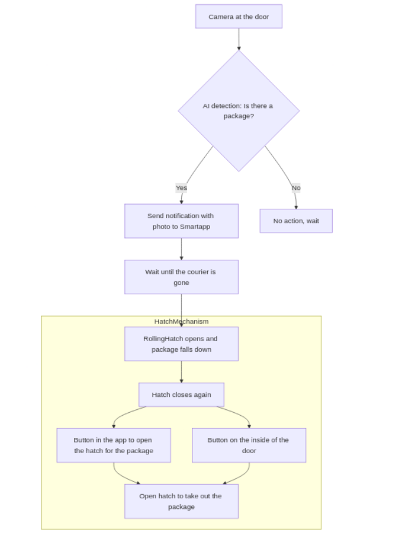
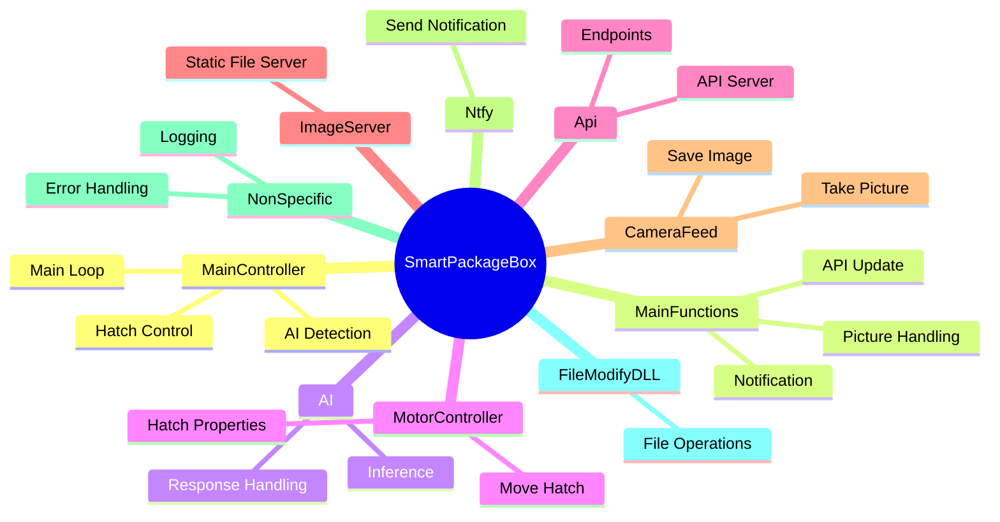
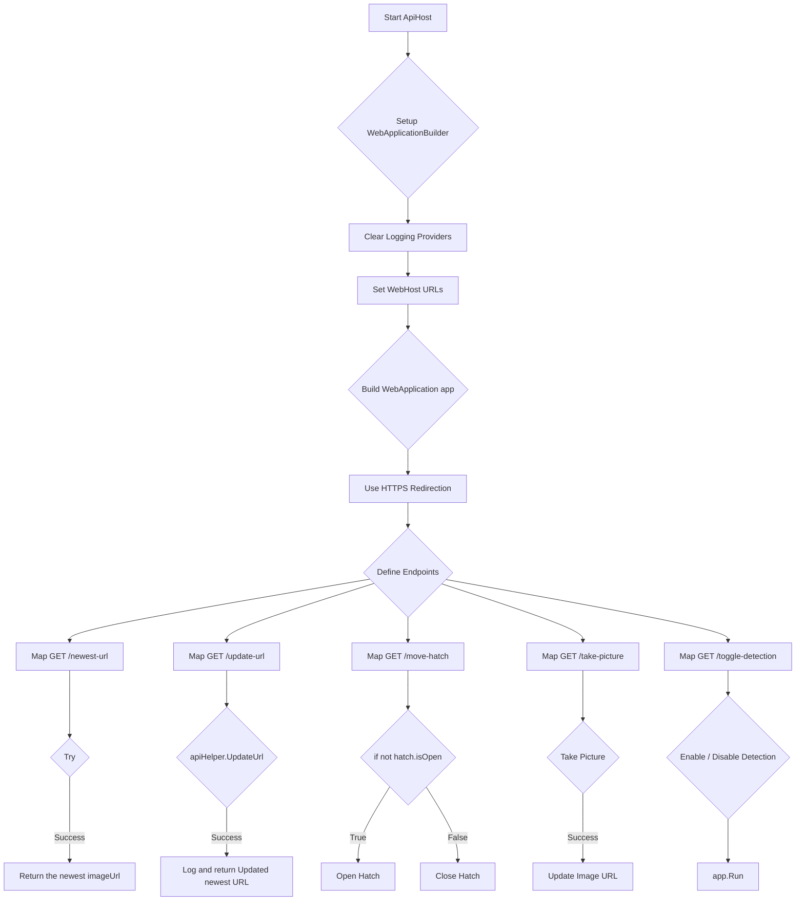
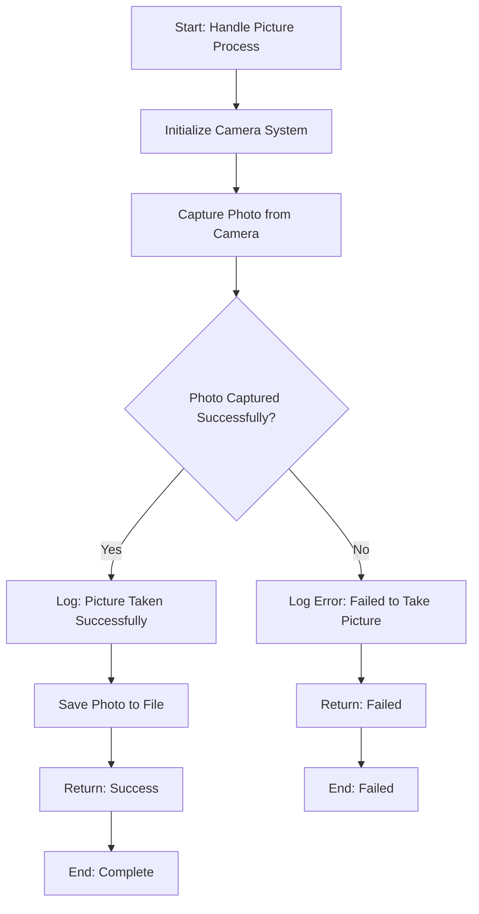
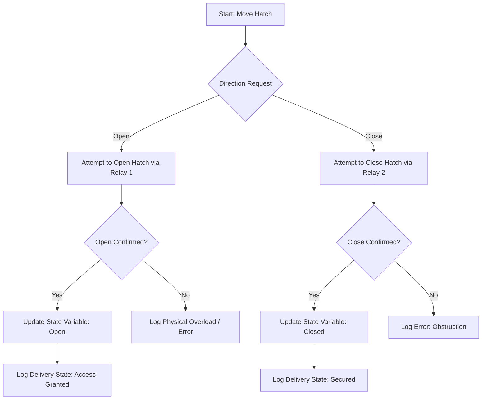
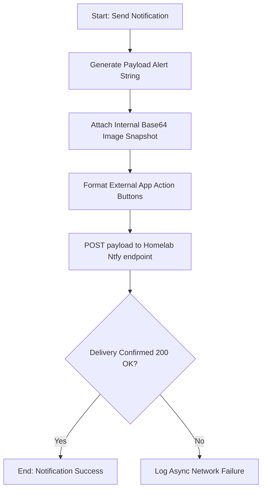
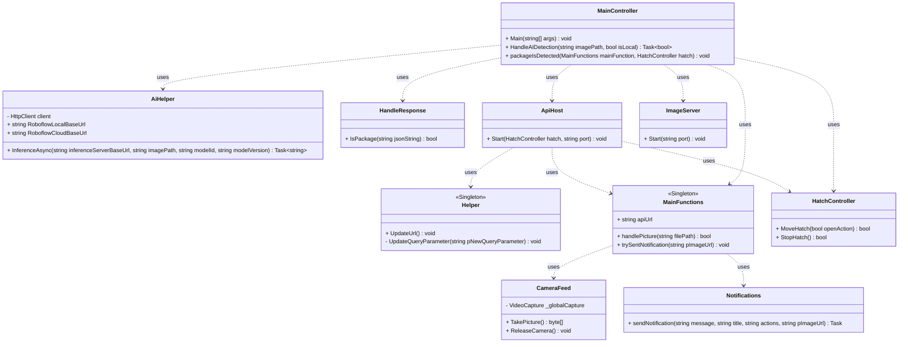
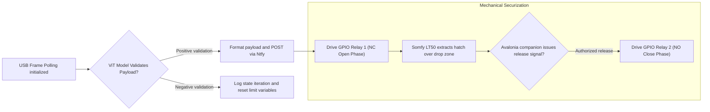
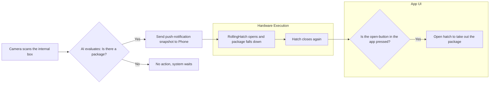

# Software Architecture and Logic Flow

The application environment of the SmartPackageBox relies heavily on deeply segmented Object-Oriented principles. Developed entirely natively in C# via the `.NET 9` framework, the architecture is isolated into modular logic nodes, promoting stability and cross-platform UI synthesis via Avalonia.

## Architectural Design and Namespaces

Rather than relying on monolithic execution scripts, the system distributes duties among several key components grouped into namespaces.

### 1. The Central Conductor: `MainController`
Established fundamentally as a Singleton, `MainController` functions stringently as the execution orchestrator across all operations. The core sequence follows strict procedural synchronization: wait for triggers, initialize frame extraction, dispatch AI HTTP requests, parse boolean returns, trigger motor mechanisms, and invoke the notification module.

### 2. Network Endpoint: `ApiHost`
Deployed as a Minimal C# API interface, `ApiHost` constructs the control bridge allowing mobile instances to access camera fields and force mechanical overrides asynchronously. 
* **Cache-Busting Integration**: Devices aggressively cache network imagery to optimize data transfers. To ensure the user's mobile app perpetually views the current drop-zone configuration, `ApiHost` algorithmically generates and appends dynamically updated timestamps (`?t=ticks`) as query parameters to image URL routings.

### 3. Visual Buffering: `CameraFeed`
Operating the external Logitech logic presents significant buffer constraints. Under continuous testing, the camera frequently locked up or returned stale imagery out of its native internal buffer queue resulting in validation errors. 
* **Buffer-Flushing Logic**: The code initiates continuous connections but selectively pulls "dummy frames" instantly prior to executing `TakePicture()`, safely overriding the inherent camera buffer cache and generating an accurate real-time payload array.

### 4. Actuation Subsystem: `MotorController`
Translating code logic back over the physical interface relies on manipulating GPIO endpoints towards the AC relay arrays. 
* **Variable Interlock**: Physical motors combust if dual-phase reverse inputs hit their capacitors. The `MotorController` software safeguards the setup by implementing a restrictive `bool isOpen` state gate which absolutely prevents executing operational commands contrary to the current physical limits regardless of API requests.

### 5. Utilities: `Notifications` and `Logger`
* **Ntfy Interface**: Bypasses convoluted third-party messaging queues by implementing a lightweight HTTP client to a self-hosted Ntfy deployment within the homelab network. Appends visual snapshots natively as notification payloads.

* **FileHelper**: Consolidates stack trace anomalies effectively in isolated logical chronological documents to limit crash instances to background processes.

## Software Class Relationships

The interaction array of the distinct controller dependencies and API endpoints is encapsulated functionally via the following Mermaid relational schema:

## Program Lifecycle Routing

The operational algorithm functions perpetually on state loops analyzing sensor validation against the external AI models.

