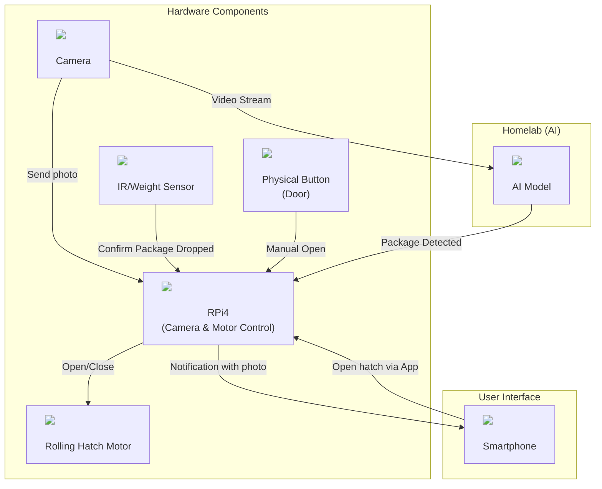

```mermaid
flowchart TD
  subgraph Homelab["Homelab (AI)"]
    A["<img src='../hardware/images/HPElitedesk.jpg' width='40'><br>AI Model"]
  end

  subgraph Hardware["Hardware Components"]
    B["<img src='../hardware/images/WebcamC270.jpg' width='40'><br>Camera"] -- "Send photo" --> C["<img src='../hardware/images/RPi4.jpg' width='40'><br>RPi4<br>(Camera & Motor Control)"]
    D["<img src='../hardware/images/somfyLT50.jpg' width='40'><br>Rolling Hatch Motor"]
    F["<img src='../hardware/images/Idk.png' width='40'><br>IR/Weight Sensor"] -- "Confirm Package Dropped" --> C
    G["<img src='../hardware/images/doorButtonConcept.jpg' width='40'><br>Physical Button<br>(Door)"] -- "Manual Open" --> C
  end

  subgraph UI["User Interface"]
    H["<img src='../hardware/images/phoneConcept.jpg' width='40'><br>Smartphone"]
  end

  %% Flows (same arrows/labels as original)
  B -- "Video Stream" --> A
  A -- "Package Detected" --> C
  C -- "Open/Close" --> D
  C -- "Notification with photo" --> H
  H -- "Open hatch via App" --> C
```
