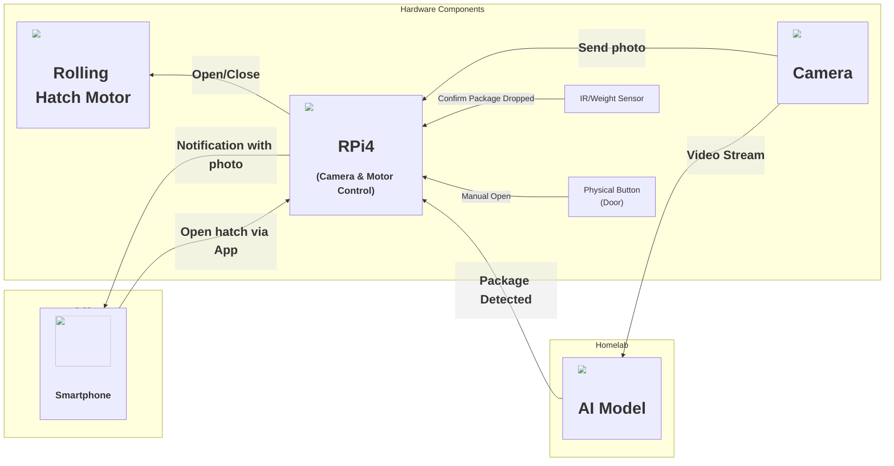

```mermaid
flowchart RL
  subgraph Homelab["Homelab"]
    direction LR // Optional, for a single item doesn't do much but good practice if more added
    A["<img src='../hardware/images/HPElitedesk.jpg' width='100'><br><h1>AI Model"]
  end

  subgraph Hardware["Hardware Components"]
    direction LR // This will spread B, C, D, F, G more horizontally
    B["<img src='../hardware/images/WebcamC270.jpg' width='60'><br><h1>Camera"]
    C["<img src='../hardware/images/RPi4.jpg' width='60'><br><h1>RPi4<br><h3>(Camera & Motor Control)"]
    D["<img src='../hardware/images/somfyLT50.jpg' width='60'><br><h1>Rolling Hatch Motor"]
    F["IR/Weight Sensor"]
    G["Physical Button<br>(Door)"]

    %% Connections within Hardware subgraph
    B -- "<h2>Send photo" --> C
    F -- "Confirm Package Dropped" --> C
    G -- "Manual Open" --> C
    C -- "<h2>Open/Close" --> D
  end

  subgraph UI["<h1>UI"]
    direction LR // Optional, for a single item
    H["<img src='../hardware/images/phoneConcept.jpg' height='100' width='50'><br><h3>Smartphone"]
  end

  %% Flows (Inter-subgraph connections)
  B -- "<h2>Video Stream" --> A
  A -- "<h2>Package Detected" --> C
  C -- "<h2>Notification with photo" --> H
  H -- "<h2>Open hatch via App" --> C
```