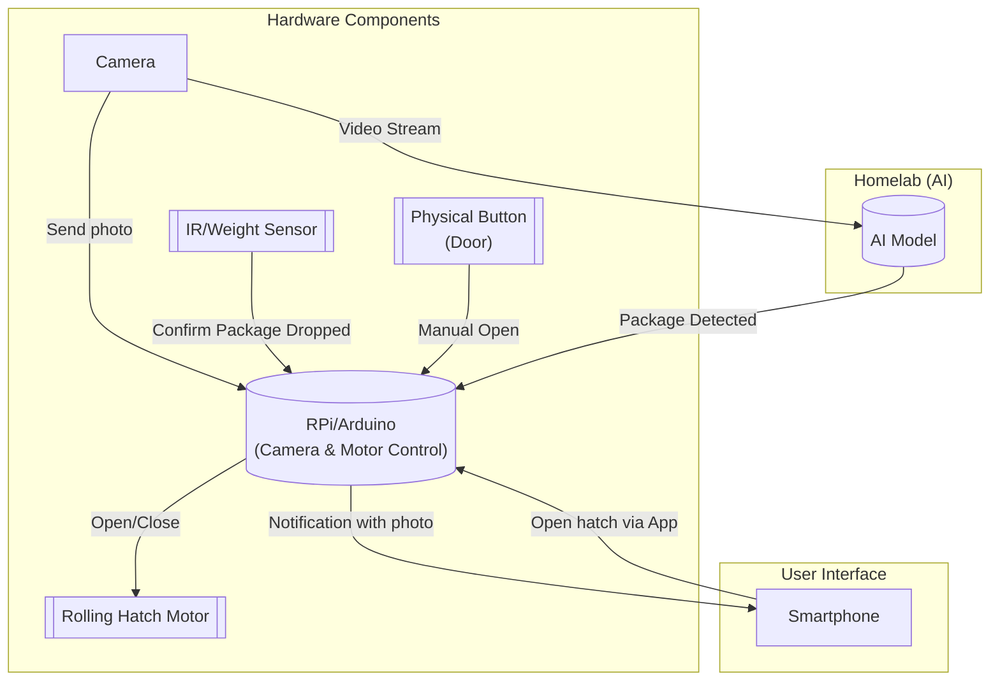

```mermaid
flowchart TD
  subgraph Homelab["Homelab (AI)"]
    A[("AI Model")]
  end

  subgraph Hardware["Hardware Components"]
    B[Camera] -- "Send photo" --> C[("RPi/Arduino<br>(Camera & Motor Control)")]
    D[[Rolling Hatch Motor]]
    F[["IR/Weight Sensor"]] -- "Confirm Package Dropped" --> C
    G[["Physical Button<br>(Door)"]] -- "Manual Open" --> C
  end

  subgraph UI["User Interface"]
    H[Smartphone]
  end

  %% Flows (same arrows/labels as original)
  B -- "Video Stream" --> A
  A -- "Package Detected" --> C
  C -- "Open/Close" --> D
  C -- "Notification with photo" --> H
  H -- "Open hatch via App" --> C
```
