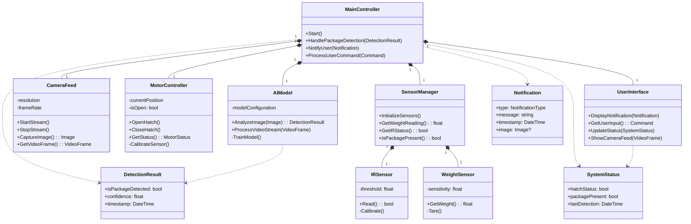

```mermaid
classDiagram
    %% Main Controller
    class MainController {
        +Start()
        +HandlePackageDetection(DetectionResult)
        +NotifyUser(Notification)
        +ProcessUserCommand(Command)
    }

    %% AI Component
    class AIModel {
        -modelConfiguration
        +AnalyzeImage(Image): DetectionResult
        +ProcessVideoStream(VideoFrame)
        -TrainModel()
    }

    %% Camera Feed
    class CameraFeed {
        -resolution
        -frameRate
        +StartStream()
        +StopStream()
        +CaptureImage(): Image
        +GetVideoFrame(): VideoFrame
    }

    %% Motor Controller
    class MotorController {
        -currentPosition
        -isOpen: bool
        +OpenHatch()
        +CloseHatch()
        +GetStatus(): MotorStatus
        -CalibrateSensor()
    }

    %% Sensors
    class SensorManager {
        +InitializeSensors()
        +GetWeightReading(): float
        +GetIRStatus(): bool
        +IsPackagePresent(): bool
    }

    class IRSensor {
        -threshold: float
        +Read(): bool
        -Calibrate()
    }

    class WeightSensor {
        -sensitivity: float
        +GetWeight(): float
        -Tare()
    }

    %% UI
    class UserInterface {
        +DisplayNotification(Notification)
        +GetUserInput(): Command
        +UpdateStatus(SystemStatus)
        +ShowCameraFeed(VideoFrame)
    }

    %% Data Types
    class DetectionResult {
        +isPackageDetected: bool
        +confidence: float
        +timestamp: DateTime
    }

    class SystemStatus {
        +hatchStatus: bool
        +packagePresent: bool
        +lastDetection: DateTime
    }

    class Notification {
        +type: NotificationType
        +message: string
        +timestamp: DateTime
        +image: Image?
    }

    %% Relationships
    MainController "1" *-- "1" AIModel
    MainController "1" *-- "1" CameraFeed
    MainController "1" *-- "1" MotorController
    MainController "1" *-- "1" SensorManager
    MainController "1" *-- "1" UserInterface
    SensorManager "1" *-- "1" IRSensor
    SensorManager "1" *-- "1" WeightSensor
    MainController ..> DetectionResult
    MainController ..> SystemStatus
    MainController ..> Notification
    UserInterface ..> SystemStatus
    AIModel ..> DetectionResult
```
