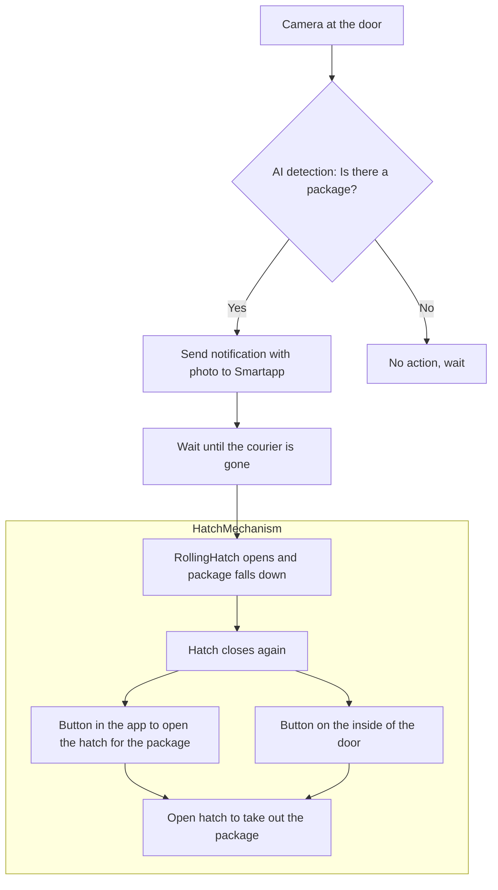

```mermaid
flowchart TD
 subgraph HatchMechanism["HatchMechanism"]
        E["RollingHatch opens and package falls down"]
        F["Hatch closes again"]
        H["Open hatch to take out the package"]
        G["Button in the app to open the hatch for the package"]
        K["Button on the inside of the door"]
  end
    A["Camera at the door"] --> B{"AI detection: Is there a package?"}
    B -- Yes --> C["Send notification with photo to Smartapp"]
    C --> D["Wait until the courier is gone"]
    D --> E
    E --> F
    F --> G & K
    G --> H
    K --> H
    B -- No --> I["No action, wait"]
```
