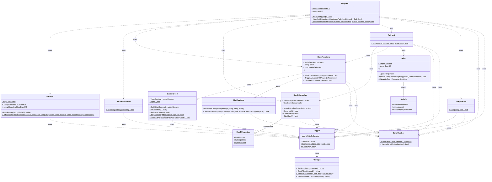

```mermaid
classDiagram
    %% AI Namespace
    class AiHelper {
        - HttpClient client$
        + string RoboflowLocalBaseUrl$
        + string RoboflowCloudBaseUrl$
        - ReadApiKey(string filePath)$ string
        + InferenceAsync(string inferenceServerBaseUrl, string imagePath, string modelId, string modelVersion)$ Task~string~
    }

    class HandleResponse {
        + IsPackage(string jsonString)$ bool
    }

    %% API Namespace
    class ApiInfo {
        + string mNewestUrl
        # string baseUrl
        # string mQueryParameter
    }

    class Helper {
        + Helper Instance$
        + string BaseUrl$
        + UpdateUrl() void
        - UpdateQueryParameter(string pNewQueryParameter) void
        - CalculateQueryParameter() string
    }

    class ApiHost {
        + Start(HatchController hatch, string port)$ void
    }

    %% CameraFeed Namespace
    class CameraFeed {
        - VideoCapture _globalCapture$
        - object _lock$
        - GetOrStartCamera()$ VideoCapture
        + TakePicture()$ byte[]
        + ReleaseCamera()$ void
        + StopCamera(VideoCapture capture)$ void
        + SaveImage(byte[] imageBytes, string name)$ void
    }

    %% Functions Namespace
    class MainFunctions {
        + MainFunctions Instance$
        + string apiUrl
        + bool enableDetection
        + trySentNotification(string pImageUrl) void
        + TriggerApiUpdateUrlAsync() Task~bool~
        + handlePicture(string filePath) bool
    }

    %% MotorController Namespace
    class HatchProperties {
        + bool isOpen
        + byte openPin$
        + byte closePin$
    }

    class HatchController {
        + HatchProperties hatchProperties
        - GpioController controller
        + MoveHatch(bool openAction) bool
        - OpenHatch() bool
        - CloseHatch() bool
        + StopHatch() bool
    }

    %% NonSpecific Namespace
    class ErrorHandler {
        - CatchError(Action function)$ Exception
        + HandleError(Action function)$ bool
    }

    class Logger {
        - bool bWriteToConsole$
        - GetPath()$ string
        + Log(string subject, string text)$ void
        + ReadLog()$ string
    }

    %% FileModifyDLL Namespace
    class FileHelper {
        + GetString(string message)$ string
        + ReadFile(string path)$ string
        + AppendToFile(string path, string value)$ string
        + WriteFile(string path, string value)$ string
    }

    %% Ntfy Namespace
    class Notifications {
        - ReadNtfyConfig(string fileUrl)$ (string, string, string)
        + sendNotification(string message, string title, string actions, string pImageUrl)$ Task
    }

    %% ImageServer Namespace
    class ImageServer {
        + Start(string port)$ void
    }

    %% Main Program
    class Program {
        + string imageServerUrl$
        + string apiUrl$
        + Main(string[] args)$ void
        + HandleAIDetection(string imagePath, bool isLocal)$ Task~bool~
        + packageIsDetected(MainFunctions mainFunction, HatchController hatch)$ void
    }

    %% Relationships
    Helper --|> ApiInfo : inherits
    HatchController --o HatchProperties : composition
    
    Program ..> AiHelper : uses
    Program ..> HandleResponse : uses
    Program ..> MainFunctions : uses
    Program ..> HatchController : uses
    Program ..> ApiHost : uses
    Program ..> ImageServer : uses
    Program ..> ErrorHandler : uses
    Program ..> Logger : uses
    
    ApiHost ..> HatchController : uses
    ApiHost ..> MainFunctions : uses
    ApiHost ..> Helper : uses
    ApiHost ..> ErrorHandler : uses
    ApiHost ..> Logger : uses
    
    MainFunctions ..> CameraFeed : uses
    MainFunctions ..> Notifications : uses
    MainFunctions ..> ErrorHandler : uses
    MainFunctions ..> Logger : uses
    
    HatchController ..> ErrorHandler : uses
    HatchController ..> Logger : uses
    
    AiHelper ..> Logger : uses
    HandleResponse ..> Logger : uses
    
    CameraFeed ..> Logger : uses
    
    Notifications ..> Logger : uses
    Notifications ..> ErrorHandler : uses
    
    ImageServer ..> Logger : uses
    ImageServer ..> ErrorHandler : uses
    
    Logger ..> FileHelper : uses
    
    %% Singletons
    Helper : <<Singleton>>
    MainFunctions : <<Singleton>>
```